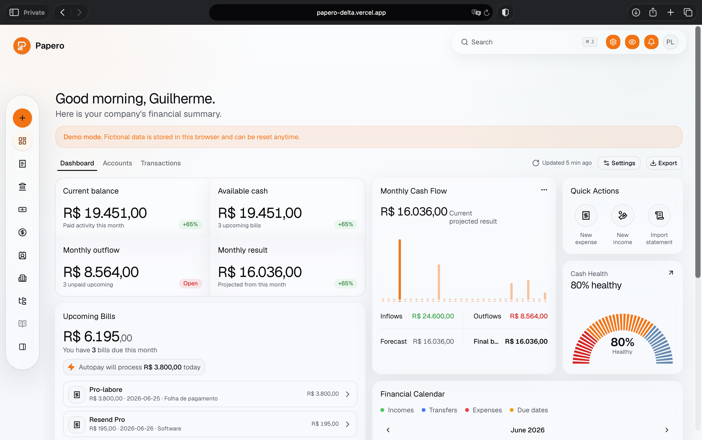
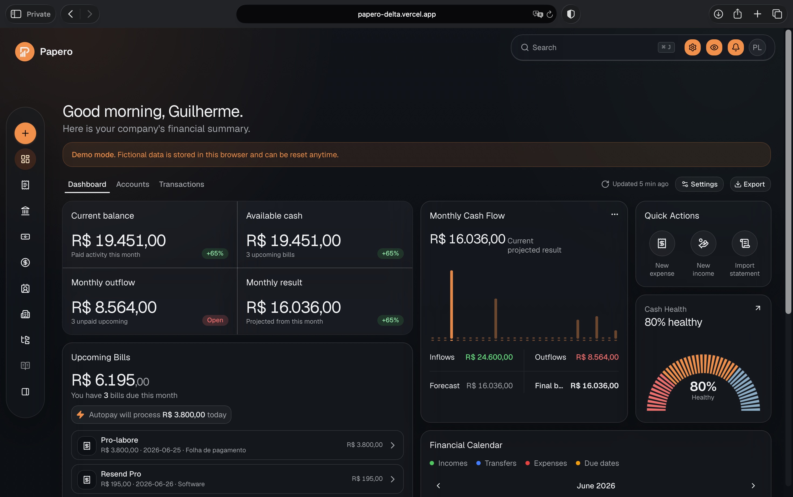
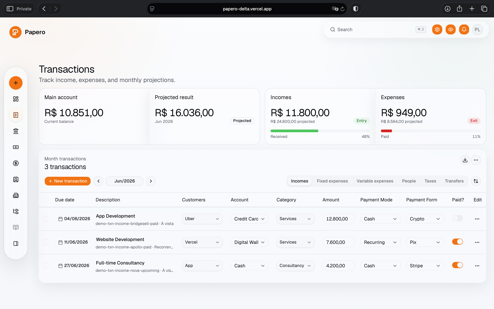
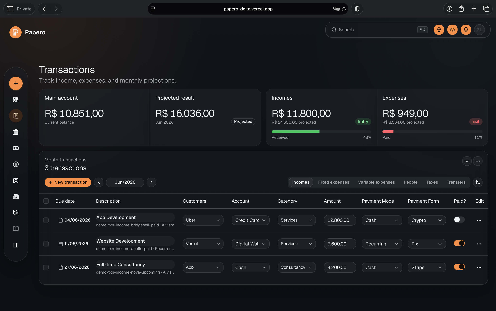
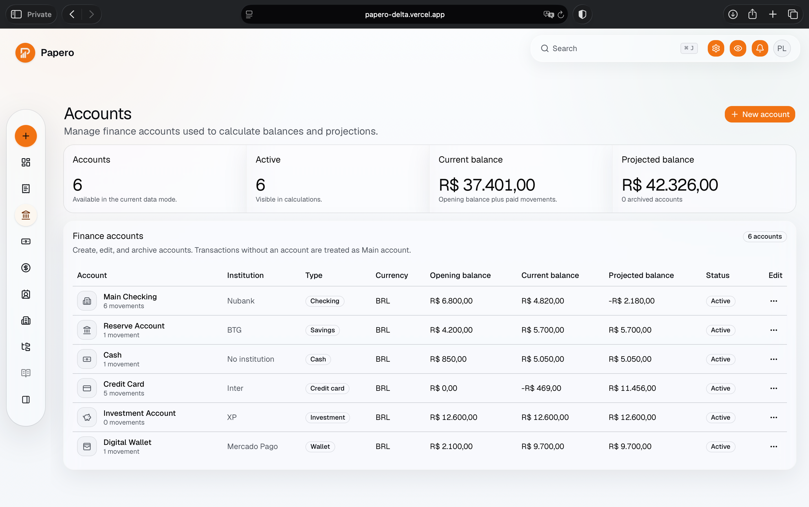
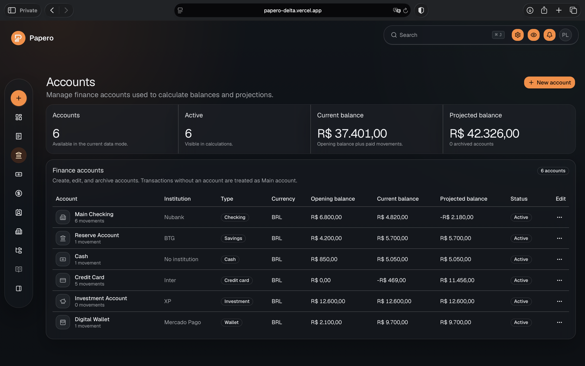
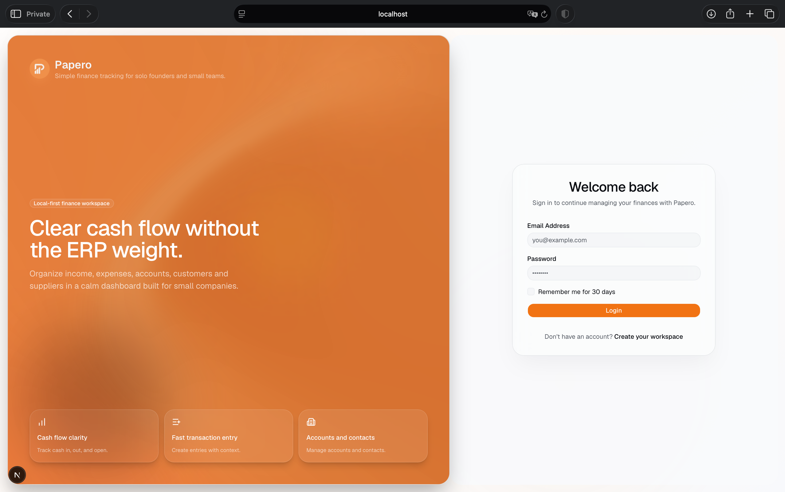

# Papero

Papero is an open-source, local-first finance dashboard for small businesses, solo founders, agencies and developers who want a simple way to track income, expenses, customers, suppliers and cash flow. It works locally today and is moving toward a self-hostable setup with PostgreSQL, Prisma and real authentication.

Screenshot coming soon.

## Live Demo

Try Papero here: [papero-delta.vercel.app](https://papero-delta.vercel.app/dashboard/finance)

## Screenshots

### Main Dashboard

| Light Mode | Dark Mode |
|---|---|
|  |  |

### Transactions

| Light Mode | Dark Mode |
|---|---|
|  |  |

### Accounts

| Light Mode | Dark Mode |
|---|---|
|  |  |

### Login



## Status

Papero is currently an open-source MVP with local, demo and database modes.

- Local/demo finance data is stored in browser `localStorage`; database mode persists core finance records through PostgreSQL/Prisma.
- Prisma/PostgreSQL infrastructure is prepared and finance domains are being connected by mode.
- Better Auth email/password login and registration are implemented for database mode.
- Database-mode registration creates or ensures a default company/workspace and OWNER membership.
- Database-backed accounts, categories, contacts and transactions are available.
- Papero is not production-ready accounting software yet.

The current goal is to keep Papero useful as a polished finance workspace while hardening database mode, QA coverage and open-source contribution workflows.

## What Works Today

Papero currently works as a polished local-first finance MVP.

- You can manage finance records in the browser using `localStorage`.
- Local data persists across page refreshes and app restarts in the same browser profile.
- Local data can be lost if browser data is cleared, a different browser or device is used, private browsing is used, or Papero's clear local data control is clicked.
- You can create and edit transactions, incomes, expenses, categories, customers and suppliers.
- Demo data can be loaded, reset and cleared from the app.
- Database mode can persist accounts, categories, contacts and transactions through PostgreSQL/Prisma.

For serious daily use, database mode is the recommended direction, but Papero should still be treated as an early MVP.

### Finance Dashboard Behavior

- Accounts can be classified as Operating or Reserve.
- Current Balance includes all active accounts, including Operating and Reserve accounts.
- Available Cash includes only active Operating accounts.
- Reserve accounts are excluded from operational cash flow and monthly cash flow projections.
- The dashboard also summarizes monthly inflows, outflows, forecast, recent incomes and recent expenses with English and Portuguese UI.

## Data Modes

Papero supports three data modes:

- `local`: no database or login required. Finance data is stored in browser `localStorage`. This is good for quick local use, UI work and development.
- `demo`: no database or login required. Finance data is stored in browser `localStorage` and fictional demo data is auto-loaded on the first empty visit.
- `database`: PostgreSQL and Better Auth are required. Dashboard routes are protected, login/register are enabled, auth creates or ensures `User`, `Account`, `Session`, `Company` and `CompanyMember` records, and core finance records are persisted through Prisma/PostgreSQL.

Set both mode variables to the same value in local development:

```env
NEXT_PUBLIC_PAPERO_DATA_MODE="local"
PAPERO_DATA_MODE="local"
```

If mode variables are omitted or invalid, Papero defaults toward open-source-safe local behavior where applicable.

## Features

- Overview dashboard
- Transactions
- Incomes
- Expenses
- Categories
- Customers
- Suppliers
- Demo/reset data
- Privacy mode for hiding financial values
- Preferences panel for theme, fonts, layout, navbar and sidebar options
- Papero Glass default theme
- Real font switching

## Demo Data

Papero includes local demo controls so you can explore the product without creating data manually.

- Load demo data
- Reset demo data
- Clear local data

The active MVP stores this data locally in your browser. Clearing browser storage or using Papero's clear local data control removes it from the current browser.

Public demo deployments can set `NEXT_PUBLIC_PAPERO_DATA_MODE="demo"` to automatically load fictional localStorage data on the first empty visit. Demo mode remains browser-local and resettable; users can still create their own expenses and incomes while exploring.

## Deploy Public Demo to Vercel

For a public demo, deploy Papero in `demo` mode. This does not require PostgreSQL, Better Auth secrets or a shared backend.

Set these Vercel environment variables:

```env
NEXT_PUBLIC_PAPERO_DATA_MODE="demo"
PAPERO_DATA_MODE="demo"
```

In demo mode, fictional data is seeded into each visitor's browser `localStorage`. Visitor-created data stays in that browser and can be reset or cleared from the dashboard. This is useful for public exploration, not for a production SaaS deployment.

Papero runs `prisma generate` during install so clean Vercel builds have Prisma Client types available. This generation step does not connect to a database and does not make database variables required for demo mode.

Better Auth and PostgreSQL variables are only required in `database` mode. Public demo deployments should not set placeholder auth secrets just to satisfy a build; auth routes are disabled in `local` and `demo` mode, and server code should only import Better Auth after confirming database mode.

Use `database` mode separately when you want PostgreSQL persistence and real auth.

## Tech Stack

- Next.js
- TypeScript
- Tailwind CSS
- shadcn/ui
- next-intl
- Prisma
- PostgreSQL
- Docker Compose
- Zustand
- Recharts
- TanStack Table
- React Hook Form
- Zod
- Biome

## Local/Demo Quick Start

Install dependencies:

```bash
nvm use
npm install
```

Create a local environment file:

```bash
cp .env.example .env.local
```

For local mode, set:

```env
NEXT_PUBLIC_PAPERO_DATA_MODE="local"
PAPERO_DATA_MODE="local"
```

Start the development server:

```bash
npm run dev
```

Open:

```text
http://localhost:3000/dashboard/finance
```

For demo mode, set both mode variables to `demo`, restart the dev server, then open `/dashboard/finance`. Demo mode auto-loads fictional localStorage data when the browser stores are empty.

## Database Auth Setup

Database infrastructure is included for contributors and database-backed finance work.

Running migrations prepares a PostgreSQL database and enables Better Auth for `database` mode.

The same Prisma setup works with local Docker PostgreSQL, Supabase, Render, Neon, Railway or another hosted PostgreSQL provider as long as `DATABASE_URL` is valid.

### Option A: Local Postgres with Docker

Docker is optional and only needed if you want to run PostgreSQL locally.

Create a local environment file:

```bash
cp .env.example .env.local
```

Start local PostgreSQL:

```bash
docker compose up -d postgres
```

Generate Prisma Client:

```bash
npm run db:generate
```

Run migrations:

```bash
npm run db:migrate
```

### Option B: Hosted Postgres

You can also use Supabase, Render, Neon, Railway or another hosted PostgreSQL provider.

1. Create a PostgreSQL database with your provider.
2. Copy the provider's PostgreSQL connection string.
3. Create `.env.local` from `.env.example`.
4. Replace `DATABASE_URL` in `.env.local` with the hosted connection string.
5. Run the same Prisma commands:

```bash
npm run db:generate
npm run db:migrate
```

No Docker is required when using hosted Postgres. Hosted providers may require SSL in the connection string, such as `sslmode=require`.

### Environment Variables

For database auth testing, set these values in `.env.local`:

```env
DATABASE_URL="postgresql://..."
BETTER_AUTH_SECRET="replace-with-a-strong-secret"
BETTER_AUTH_URL="http://localhost:3000"
BETTER_AUTH_TRUSTED_ORIGINS="http://localhost:3000"
NEXT_PUBLIC_APP_URL="http://localhost:3000"
NEXT_PUBLIC_PAPERO_DATA_MODE="database"
PAPERO_DATA_MODE="database"
```

Generate a strong Better Auth secret with:

```bash
openssl rand -base64 32
```

`NEXT_PUBLIC_PAPERO_DATA_MODE` controls client behavior. `PAPERO_DATA_MODE` controls server/proxy behavior. They should usually match.

For a production database deployment with custom and Vercel domains, use the custom domain as the canonical URL and list every exact login origin:

```env
BETTER_AUTH_URL="https://web.papero.app"
NEXT_PUBLIC_APP_URL="https://web.papero.app"
BETTER_AUTH_TRUSTED_ORIGINS="https://web.papero.app,https://papero-gtse.vercel.app,https://your-other-production-domain.vercel.app"
NEXT_PUBLIC_PAPERO_DATA_MODE="database"
PAPERO_DATA_MODE="database"
```

Authentication requests use the domain currently open in the browser, while Better Auth validates that domain against `BETTER_AUTH_TRUSTED_ORIGINS`. Use exact production origins rather than a broad `*.vercel.app` wildcard. Session cookies remain scoped to the host where login occurred, so signing in on one domain does not automatically sign in the other domains.

The public demo only needs the two mode variables set to `demo`; it does not need database or Better Auth environment variables.

### Database Mode Validation

After applying migrations and starting the dev server:

1. Open `/dashboard/finance` while logged out.
2. Expected: redirect to `/auth/v2/login`.
3. Open `/auth/v2/register` and create an account.
4. Expected: Papero creates or ensures `User`, `Account`, `Session`, `Company` and `CompanyMember` with OWNER role.
5. Expected: successful registration redirects to `/dashboard/finance`.
6. Log out from the user menu.
7. Expected: logout redirects to `/auth/v2/login`.
8. Log in again.
9. Expected: login redirects to `/dashboard/finance` and the user menu shows the authenticated user.

### Prisma Studio

Open Prisma Studio with:

```bash
npm run db:studio
```

Useful tables to inspect while testing auth:

- `User`
- `Account`
- `Session`
- `Company`
- `CompanyMember`
- `Subscription`

### Billing and Stripe

Papero includes company-level billing for the `Open Source`, `Hosted` and `Custom` plans. Open-source, self-hosted, local and demo usage does not require Papero-managed billing. Stripe Checkout and Customer Portal are available only when a database-mode deployment is explicitly configured with private Stripe credentials.

Payment-provider credentials, webhook secrets and production Price IDs belong in private deployment environment variables and must never be committed to this repository.

- Existing and newly created companies default to `Open Source` with `Free` status.
- Stripe variables are not required for local/demo mode or for a database-mode build. Checkout and Portal return a configuration error until Stripe is configured.
- Billing-provider routes return `404` in local and demo modes and do not initialize Stripe, auth or Prisma there.
- `PAPERO_BILLING_ENFORCEMENT` defaults to `optional`, preserving unrestricted finance access for forks, self-hosted deployments and existing open-source usage.

The official hosted service can require commercial access with this server-only setting:

```env
PAPERO_BILLING_ENFORCEMENT="required"
```

When enforcement is `required`, only `Hosted` or `Custom` subscriptions in `Trialing` or `Active` status can access finance pages and APIs. `Free`, `Canceled`, `Past due`, `Unpaid`, `Incomplete` and `Paused` subscriptions are blocked with a plan-selection flow. Stripe webhooks remain the only authority that grants or removes paid access.

Enabling enforcement does not invent or migrate paid subscriptions. Existing companies that are still `Open Source`/`Free` will be blocked and offered Checkout immediately, so official deployments should coordinate that rollout with current customers. Leave the setting unset or `optional` when this behavior is not intended.

#### Stripe setup

1. In Stripe, create `Hosted` and `Custom` Products with recurring monthly and yearly Prices in BRL. The displayed catalog prices are Hosted R$19/month and Custom R$49/month; yearly Price amounts must match the values in `src/config/billing-plans.ts`.
2. Configure the four resulting `price_...` identifiers as `BILLING_HOSTED_MONTHLY_PRICE_ID`, `BILLING_HOSTED_YEARLY_PRICE_ID`, `BILLING_CUSTOM_MONTHLY_PRICE_ID` and `BILLING_CUSTOM_YEARLY_PRICE_ID`.
3. Set `STRIPE_SECRET_KEY` and `STRIPE_WEBHOOK_SECRET` only in the private database-mode deployment. Set `NEXT_PUBLIC_APP_URL` to its canonical HTTPS origin.
4. Enable Stripe Customer Portal in the Stripe Dashboard.
5. Add a webhook endpoint at `https://your-app.example.com/api/billing/webhook` and select:
   `checkout.session.completed`, `customer.subscription.created`, `customer.subscription.updated`, `customer.subscription.deleted`, `invoice.paid` and `invoice.payment_failed`.

For local webhook testing, run the database-mode app with Stripe test credentials, then forward Stripe events:

```bash
stripe listen --forward-to localhost:3000/api/billing/webhook
```

Use the `whsec_...` value printed by Stripe CLI as the local `STRIPE_WEBHOOK_SECRET`. Use test Products, Prices and cards only.

The Stripe integration migration adds webhook-event deduplication and the paused subscription status. Generate Prisma Client with `npm run db:generate`, then apply migrations only through the appropriate test, staging or production deployment workflow. Do not run development migrations directly against a production database.

### Security Notes

- Never commit `.env.local`.
- Never commit real secrets or database URLs.
- Use a strong `BETTER_AUTH_SECRET`.
- Rotate database passwords if they are leaked.
- Use provider-recommended SSL settings for hosted PostgreSQL.

Fresh production builds may require network access because `next/font/google` fetches optimized font assets during build.

## Scripts

- `npm run dev` - start the local development server
- `npm run check` - run Biome checks
- `npm run build` - create a production build
- `npm run db:generate` - generate Prisma Client
- `npm run db:migrate` - run Prisma migrations in development
- `npm run db:seed` - seed the local database
- `npm run db:studio` - open Prisma Studio

## Current Limitation

Papero is still an early MVP. Transfers now support source and target accounts and are treated as account movements in balances, but advanced transfer workflows may still need product and QA polish. Recurring and installment workflows exist but may also need refinement. Database mode requires external PostgreSQL setup.

Local/demo modes remain browser-local by design.

## Contributing

Papero welcomes QA reports, bug reports, feature requests and pull requests.

- Read [CONTRIBUTING.md](./CONTRIBUTING.md) before opening a pull request.
- Use GitHub issue templates for bugs, feature requests and QA reports.
- Run `npm run check` and `npm run build` before submitting code changes.
- Never commit `.env.local`, real database URLs or secrets.

## Roadmap

- Import localStorage data into the database
- Advanced account-to-account transfer workflows
- Polish recurrence and installment workflows
- Reports
- Attachments and receipts
- Hosted deployment documentation
- Optional bank/Open Finance integrations later

## Credits

Papero was originally built on top of the [Next shadcn Admin Dashboard](https://github.com/arhamkhnz/next-shadcn-admin-dashboard) template by [arhamkhnz](https://github.com/arhamkhnz).

The template provided the initial dashboard structure, UI foundation and layout patterns. Papero has since been heavily adapted into a finance-focused, local-first product experience for income, expenses, customers, suppliers and cash flow management.

Papero also builds on the open-source ecosystem around Next.js, shadcn/ui, Tailwind CSS, Prisma, PostgreSQL and many other libraries listed in `package.json`.

## License

Papero is released under the MIT License.

This project was originally built from an MIT-licensed dashboard template. The original template MIT notice has been preserved in `LICENSE`, and attribution is provided in the Credits section above.
